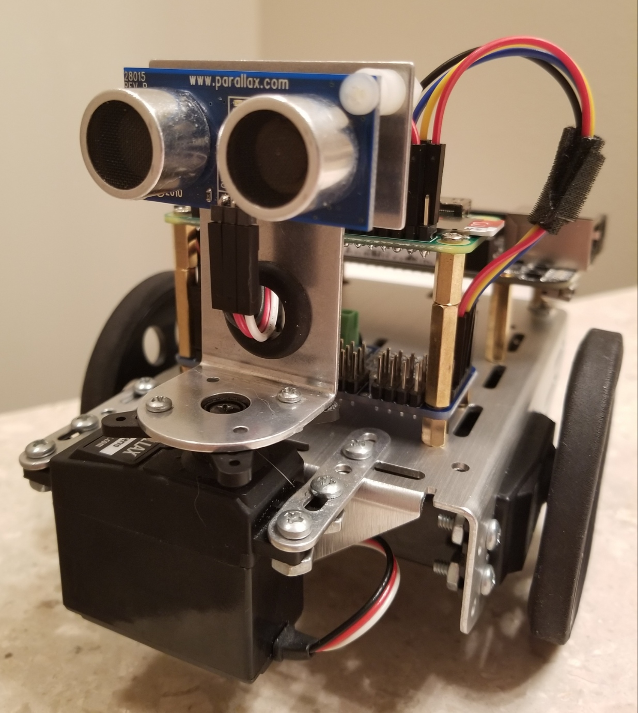

# Herbie

    

Herbie is a fun little custom robot that I've built using a Raspberry Pi Zero. Herbie can be controller via the web client using mouse and keyboard inputs with a video feed from Herbie's view.
