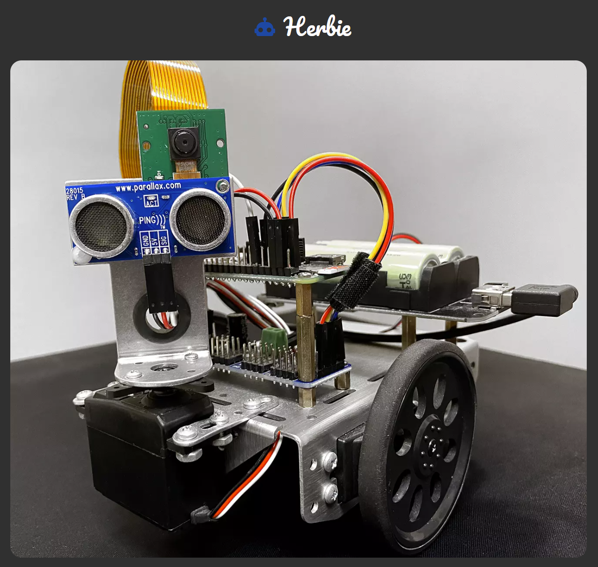

  

Herbie is a fun little custom robot that I've built using a Raspberry Pi Zero. Herbie can be controlled via the web client using mouse and keyboard inputs with a video feed from Herbie's view.

## Hardware Used

- Raspberry Pi Zero W
- Arducam Camera Module
- Diymore Double 18650 V8 Lithium Battery Shield
- PCA9685 Servo Controller
- Ultrasonic Distance Sensor
- Continuous Rotation Servo x3
